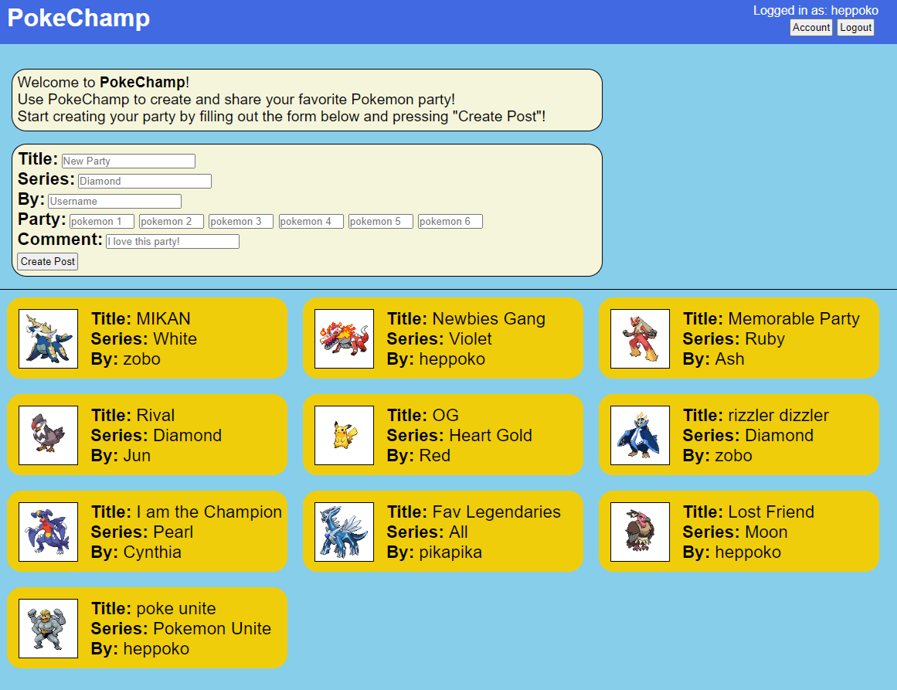

# PokeChamp

</img>

## Table of Contents

- [What is PokeChamp?](#desc)
- [How to Use](#how)
- [Technology Stack](#tech-stack)
- [Key Features](#key-features)

## What is upLife?

PokeChamp is a platform for pokemon trainers to share their favorite parties. 

## How to Use

PokeChamp is a web-based app. It is available [_here_](https://pokechamp.heppoko.space/).

## Technology Stack

PokeChampt is a full-stack web application using Javascript on the frontend, NodeJS+Express on the backend, and MongoDB as the database.

### Frontend:

- Language: Javascript
- Framework: HTML
- Styling: CSS
- API: PokeAPI
- Hosting: Netlify.com (https://pokechamp.heppoko.space/)

### Backend:

- Language: Javascript
- Framework: NodeJS, Express
- Security: JWT Authentication, Bcrypt
- Hosting: Render.com

### Database:

- Database: MongoDB

## Key Features

- Used PokeAPI to pull Pokemon images and stats to create an exciting user experience
- User can name their party and choose from different Pokemon series
- To create a party and share, a user has to sign up with a username and password, then login
- A user can view diaries created by other users as a guest, but cannot edit or delete if the diary was not created by the user.
